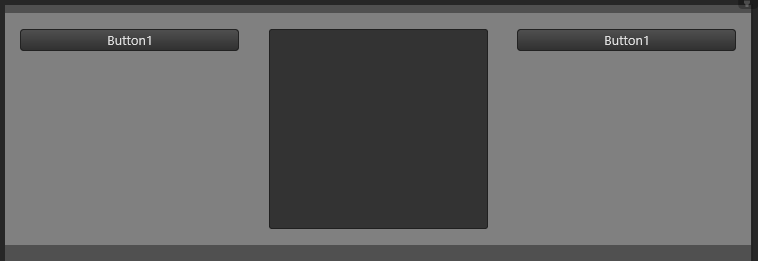
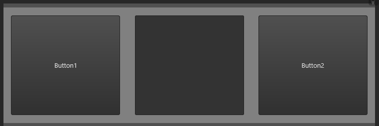

# `g-vert-tile` attribute

**Type:** Boolean<br/>
**Default:** `false`<br/>
**Allows breakdown by screen size**: Yes<br/>
**Description:** Specifies whether the Grid System should calculate the control's height to fill the available vertical area.

When set to `true`, this attribute instructs the Grid System to calculate the control's height to fill the available vertical area. This can be useful for ensuring consistent vertical spacing and alignment in your layout.


Example (without `g-vert-tile`):

```xml
<form>
	<rectangle g="container">
		<button g="col" g-width="4" text="Button1"/>
		<textEditor g="col" g-width="4" height="300"/>
		<button g="col" g-width="4" text="Button2"/>
	</rectangle>

	
	<style>
		form { g-padding-top: 8; g-cnt-line-spacing: 50; theme: dark; }	
		rectangle { color: gray; g-padding-top: 16; g-padding-bottom: 16; }				
	</style>	
</form>
```



-----

Example (with `g-vert-tile` set to `true` for the buttons):

```xml
<form>
	<rectangle g="container">
		<button g="col" g-width="4" text="Button1" g-vert-tile="true"/>
		<textEditor g="col" g-width="4" height="300"/>
		<button g="col" g-width="4" text="Button2" g-vert-tile="true"/>
	</rectangle>

	
	<style>
		form { g-padding-top: 8; g-cnt-line-spacing: 50; theme: dark; }	
		rectangle { color: gray; g-padding-top: 16; g-padding-bottom: 16; }				
	</style>	
</form>
```



By setting `g-vert-tile` to `true` for the buttons, they expand vertically to fill the available space, resulting in a layout where the buttons are vertically aligned.

!!! note
    - A control with `g-vert-tile` set to `true` will fill its line vertically.
    - A line where all controls have `g-vert-tile` set to `true` will also fill the parent's content height. So, if the vertical fillment is not occurring as expected, try setting `true` for `g-vert-tile` to all controls in a line.
    - When multiple lines want to fill a content height, the grid system will use the controls `g-vert-tile-weight` to calculate the proportion that each line will expand.

!!! warning
    - `g-vert-tile` can also shrink the control height to keep consistent vertical spacing. It's a good idea to use `g-min-height` in conjunction to avoid controls becoming too small.