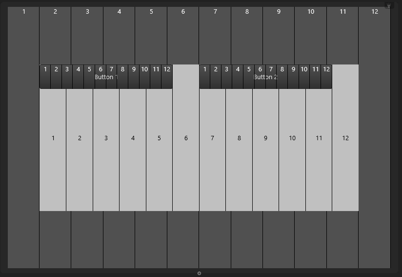
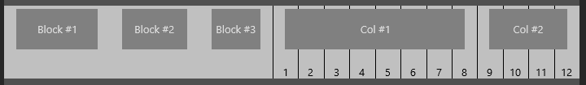
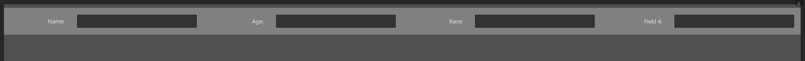
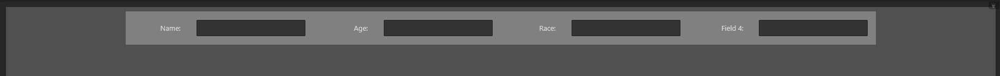
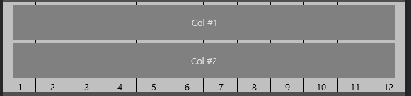
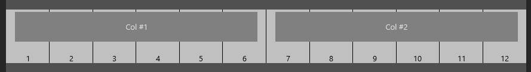

# Grid system key concepts

The Grid System is a tool designed to organize the tags/controls of your character sheet (and other Lua forms) in a way that adapts to different screen sizes. It is inspired by the grid system in the Bootstrap library, offering a flexible and powerful layout solution.

## Key concept: The 12-column division

Forms, layouts, and all other controls are structured around a 12-column grid system, which works as follows:

- **12 virtual columns**: The content area of controls is divided into 12 equal virtual columns. These columns are used for alignment and sizing.
  
- **Automatic row breaks**: When the 12 virtual columns of a row are filled, the next control automatically starts on a new row.

Here's how it looks:<br>


And here's how the grid system divides its content into 12 virtual columns:<br>



## Key concept: Roles in the grid system

Controls can assume one of 5 roles in the grid system:

- `none`: A control that does not align using the grid system. This is the default.
- `row`: A control that takes up an entire line in the 12-column division.
- `col`: A control whose width is defined by how many of the 12 columns it occupies.
- `block`: A control whose width is defined in pixels instead of 12-column spaces.
- `container`: A control that contains the entire interface layout while keeping the content width within a readable and manageable range.

!!! note
    All controls can be aligned using the grid system by assigning them a role with the [`g`](attributes.md#g-or-g-role) or [`g-role`](attributes.md#g-or-g-role) attributes.

### "row" role
Controls with the `row` role take up an entire line in the layout.

Example:
```xml
<layout name="r1" g="row" g-min-height="60"/>'
<layout name="r2" g="row" g-min-height="60"/>
<layout name="r3" g="row" g-min-height="60"/>
```


### "col" role

Controls with the `col` role have their width defined by how many of the 12 columns they occupy. This is set with the [`g-width`](attributes.md#g-width) attribute.

Example:
```xml
<!-- 1st line -->
<layout name="c1" g="col" g-width="3"/>
<layout name="c2" g="col" g-width="3"/>
<layout name="c3" g="col" g-width="3"/>

<!-- 2nd line -->
<layout name="c4" g="col" g-width="1"/>
<layout name="c5" g="col" g-width="3"/>
<layout name="c6" g="col" g-width="8"/>

<!-- 3rd line -->
<layout name="c7" g="col" g-width="8"/>

<!-- 4th line -->
<layout name="c8" g="col" g-width="6"/>
<layout name="c9" g="col" g-width="6"/>
```


!!! note
    The horizontal spaces between the aligned controls are called [gutter](gutter.md). The default gutter value is 30 and can be customized by using the [`g-gutter`](attributes.md#gutters) and/or [`g-cnt-gutter`](attrs/g-cnt-gutter.md) attributes

!!! note
    In the 3rd line, a single `col` with `g-width=8` is used. Although there's a free space of 4 columns in that line, the next control does not fit into it as it occupies 6 columns. This behavior ensures that controls are aligned properly and do not overlap.


### "block" role

Controls with the `block` role are placed in lines like `col` controls, but they don't use the 12-column spaces. Instead, they define their width in pixels, allowing precise control over their size in the layout.

Example:

```xml
<layout name="b1" g="block" width="100"/>
<layout name="b2" g="block" width="80"/>
<layout name="b3" g="block" width="450"/>
<layout name="b4" g="block" width="300"/>
```


#### Blocks and the 12-column spaces 

Controls with the `block` role don't use the available 12-column spaces. Instead, they shrink the size of the 12-column spaces available in the layout.

Example:

```xml
<layout name="b1" g="block" width="100"/>
<layout name="b2" g="block" width="80"/>
<layout name="b3" g="block" width="60"/>
```


If we add two `col` controls to the above layout:

```xml
<layout name="c1" g="col" g-width="8"/>
<layout name="c2" g="col" g-width="4"/>
```



### "container" role

Controls with the `container` role act as a wrapper for all other controls in the interface. They ensure that the content width remains within a readable and manageable range by limiting the width of the entire layout.

Example:

```xml
<?xml version="1.0" encoding="UTF-8"?>
<form name="frmMyForm" >

	<rectangle g="row">
		<label text="Name: " g="col" g-width="1"/>
		<edit g="col" g-width="2"/>
		
		<label text="Age: " g="col" g-width="1"/>
		<edit g="col" g-width="2" height="30"/>	
		
		<label text="Race: " g="col" g-width="1"/>
		<edit g="col" g-width="2"/>		

		<label text="Field 4: " g="col" g-width="1"/>
		<edit g="col" g-width="2"/>
	</rectangle>


	<style>
		form { g-padding-top: 8; g-cnt-line-spacing: 4; theme: dark}	
		rectangle { color: gray; g-padding-top: 16; g-padding-bottom: 16; }				
		label { horzTextAlign: trailing; }		
		edit, label { height: 30; }		
	</style>
</form>
```

The code above produces the following layout on an extra-large screen (width=1920):



The labels have `g-width` set to 1 and yet are too large. On larger screens, the issue would get even worse. By setting the rectangle role to `container`, we will then have the following layout on the same screen:



!!! note
    The maximum width for a container is 1378px.

!!! note
    Using a `container` control is optional. It helps maintain a consistent layout and is particularly useful when you want to prevent content from becoming too wide.


## Key concept: Screen size breakdown

Forms are given a screen size class based on their width in pixels, which helps define different layouts for different screen sizes.

| Screen Size Class | Description  | Form Width (px) |
|:-----------------:| ------------ | ----------      |
| xs                | Extra Small  | < 576           |
| sm                | Small        | >= 576          |
| md                | Medium       | >= 768          |
| lg                | Large        | >= 992          |
| xl                | Extra Large  | >= 1200         |


To specify different values for different screen sizes, append `"-xs"`, `"-sm"`, `"-md"`, `"-lg"`, or `"-xl"` to the grid attribute names. The grid system then selects the most appropriate suffix based on the screen size.

Example:

```xml
<layout g="col" g-width="12" g-width-md="6"/>
<layout g="col" g-width="12" g-width-md="6"/>
```

In this example, on screen sizes `xs` and `sm`, the width of the `col` elements will be 12, taking up the full width of the row. But on screen sizes `md` and **larger**, the width will be 6, allowing two `col` elements to be displayed side by side.

Running on `xs` and `sm` screen sizes:<br>


Running on `md` and larger screen sizes:<br>


!!! note
    Most grid system attributes can be customized for different screen sizes.