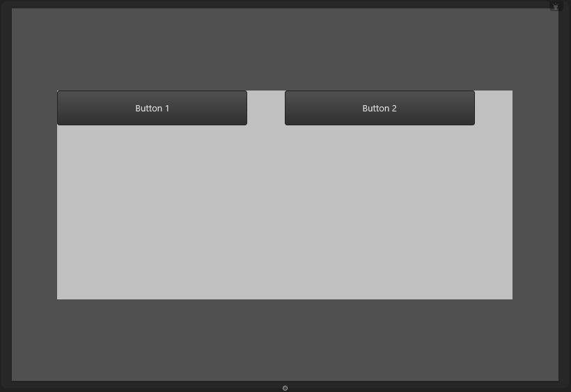
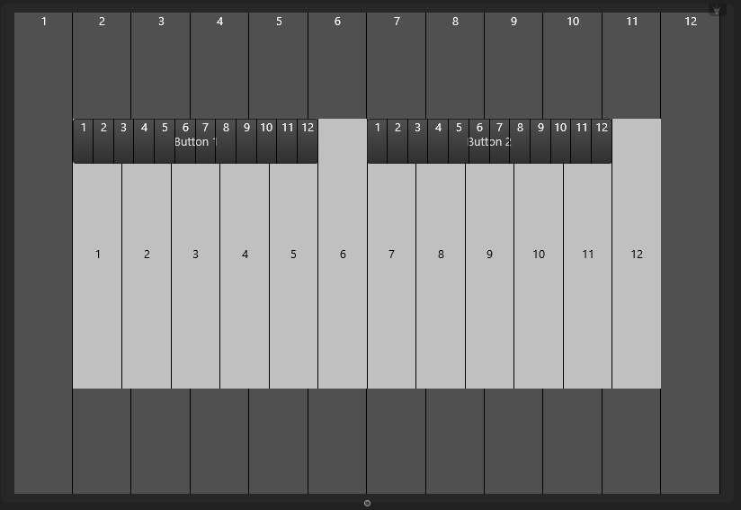
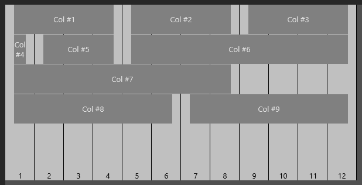
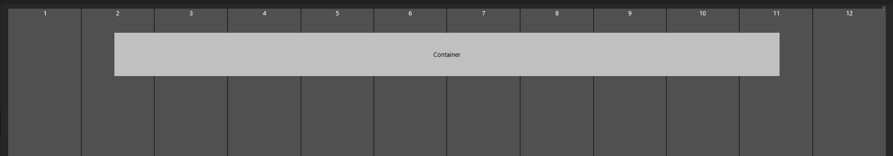

# Grid system

The Grid System is an engine designed to layout the controls of your character sheet (and other Lua forms) in a responsive manner, adjusting itself according to the user's screen size. It draws inspiration from the grid system found in the Bootstrap library, offering a flexible and powerful layout solution. 

!!! note
    All controls can be aligned using the Grid System.

## The 12-column division

Forms, layouts, and all other controls are divided into **12** virtual columns of equal size each. Their children controls are distributed in rows and automatically break into a new row after the 12 virtual columns are occupied, starting a new row.

Observe the following layout:


Here's how the grid system divides its content into 12 virtual columns:



## Roles in the grid system

Controls can assume one of 5 roles in the grid system:

- `none`: A control that does not align using the grid system. This is the default state.
- `row`: A control that occupies an entire line in the 12-column division.
- `col`: A control whose width is defined in how many of "12-column" pieces it occupies.
- `container`: A control that occupies an entire line in the 12-column division but keeps its width limited to avoid growing too wide.
- `block`: A control whose width is defined in pixels. It does not consume 12-column spaces.

The role of a control can be defined by setting it's `g` attribute.

## "row" role
When in a `row` role, the control occupies an entire line of the layout.

Example:
```xml
<layout name="row1" g="row" g-min-height="60"/>
<layout name="row2" g="row" g-min-height="60"/>
<layout name="row3" g="row" g-min-height="60"/>
```


!!! warning
    The height of the `rows` are automatically defined by its grid-aligned content. If your row is not being displayed, perhaps its height is being calculated to 0.
    In the above example, the `g-min-height` attribute was used to avoid its height becoming 0 due to a lack of content.


## "col" role

When in a `col` role, the control's width is defined by how many of the 12-column pieces it occupies by using the `g-width` attribute.

Example:
```xml
<!-- 1st line -->
<layout name="col1" g="col" g-width="3"/>
<layout name="col2" g="col" g-width="3"/>
<layout name="col3" g="col" g-width="3"/>

<!-- 2nd line -->
<layout name="col4" g="col" g-width="1"/>
<layout name="col5" g="col" g-width="3"/>
<layout name="col6" g="col" g-width="8"/>

<!-- 3rd line -->
<layout name="col7" g="col" g-width="8"/>

<!-- 4th line -->
<layout name="col8" g="col" g-width="6"/>
<layout name="col9" g="col" g-width="6"/>
```



!!! note
    The horizontal spaces between the aligned controls are called gutter. The default gutter value is 30 and can be customized.

!!! note
    In the 3rd line, a single `col` with `g-width=8` is used. Although there's a free space of 4 columns in that line, the next control does not fit into it as it occupies 6 columns. This behavior ensures that controls are aligned properly and do not overlap.


## "container" role

Controls with the `container` role act similarly to controls with the `row` role but with one key difference: they keep their width limited to avoid growing too wide. This can be useful for ensuring that content remains within a readable and manageable width.




!!! note
    Usually just one `container` is enough to organize the entire layout.


## "block" role

Controls with the `block` role are distributed in the lines similarly to `col` controls, but they do not use the 12-column spaces to do so. Instead, they define their width in pixels, allowing for precise control over their size within the layout.