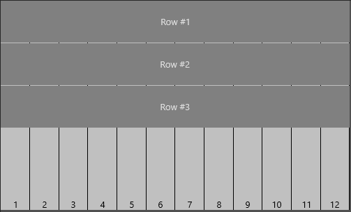

# Grid system

The Grid System is an engine designed to layout the controls of your character sheet (and other Lua forms) in a responsive manner, adjusting itself according to the user's screen size. It draws inspiration from the grid system found in the Bootstrap library, offering a flexible and powerful layout solution. 

!!! note
    All controls can be aligned using the Grid System.

## The 12-Column division

Forms, layouts, and all other controls are divided into **12** virtual columns of equal size each. Their children controls are distributed in rows and automatically break into a new row after the 12 virtual columns are occupied, starting a new row.

Observe the following layout:


Here's how the grid system divides its content into 12 virtual columns:


## Roles in the 12-column division

Controls can assume one of 5 roles in the 12-column division:

- `none`: A control that does not align using the grid system. This is the default state.
- `row`: A control that occupies an entire line in the 12-column division.
- `col`: A control whose width is defined in how many of "12-column" pieces it occupies.
- `block`: A control whose width is defined in pixels. It does not consume 12-column spaces.
- `container`: A control that occupies an entire line in the 12-column division but keeps its width limited to avoid growing too wide.

## "row" role
When in a `row` role, the control occupies an entire line of the layout.

Example:
```xml
<layout name="row1" g="row" g-min-height="60"/>
<layout name="row2" g="row" g-min-height="60"/>
<layout name="row3" g="row" g-min-height="60"/>
```



!!! warning
    The height the `rows` are automatically defined by its grid-aligned content. If your row is not being displayed, perharps its height is being calculated to 0.
    In the above example the `g-min-height` attribute was used to avoid it height becoming 0.0 due lack of content.


## "col" role

When in a `col` role, the control width is defined in how many of "12-column" pieces it occupies.

