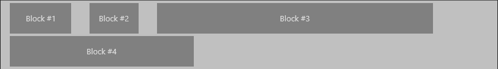
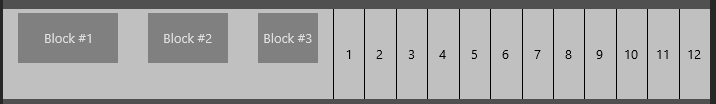
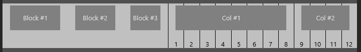
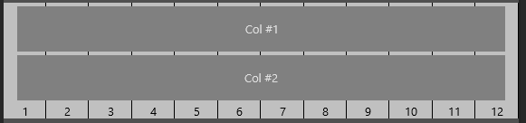
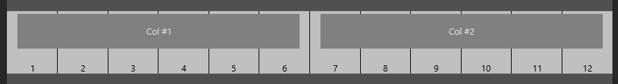

# Grid system key concepts

The Grid System is an engine designed to layout the controls of your character sheet (and other Lua forms) in a responsive manner, adjusting itself according to the user's screen size. It draws inspiration from the grid system found in the Bootstrap library, offering a flexible and powerful layout solution. 

## Key concept: The 12-column division

Forms, layouts, and all other controls are structured around a 12-column grid system, which has the following characteristics:

- **12 virtual columns**: The content area of controls is divided into 12 virtual columns of equal size. These columns are used for alignment and sizing purposes.
  
- **Automatic row breaks**: When the 12 virtual columns of a row are filled, the next control automatically starts on a new row.

Observe the following layout:


Here's how the grid system divides its content into 12 virtual columns:


!!! note
    All controls have their content area divided into 12 virtual columns, which may or may not be used for alignment with the grid system.


## Key concept: Roles in the grid system

Controls can assume one of 5 roles in the grid system:

- `none`: A control that does not align using the grid system. This is the default role.
- `row`: A control that occupies an entire line in the 12-column division.
- `col`: A control whose width is defined in how many of "12-column" pieces it occupies.
- `container`: A control that occupies an entire line in the 12-column division but keeps its width limited to avoid growing too wide.
- `block`: A control whose width is defined in pixels. It does not consume 12-column spaces.

!!! note
     All controls can be aligned using the grid system by assigning them a role through the `g` attribute.


### "row" role
When in a `row` role, the control occupies an entire line of the layout.

Example:
```xml
<layout name="r1" g="row" g-min-height="60"/>
<layout name="r2" g="row" g-min-height="60"/>
<layout name="r3" g="row" g-min-height="60"/>
```


### "col" role

When in a `col` role, the control's width is defined by how many of the 12-column pieces it occupies by using the `g-width` attribute.

Example:
```xml
<!-- 1st line -->
<layout name="c1" g="col" g-width="3"/>
<layout name="c2" g="col" g-width="3"/>
<layout name="c3" g="col" g-width="3"/>

<!-- 2nd line -->
<layout name="c4" g="col" g-width="1"/>
<layout name="c5" g="col" g-width="3"/>
<layout name="c6" g="col" g-width="8"/>

<!-- 3rd line -->
<layout name="c7" g="col" g-width="8"/>

<!-- 4th line -->
<layout name="c8" g="col" g-width="6"/>
<layout name="c9" g="col" g-width="6"/>
```


!!! note
    The horizontal spaces between the aligned controls are called gutter. The default gutter value is 30 and can be customized by using the `g-gutter` and/or `g-cnt-gutter` attributes

!!! note
    In the 3rd line, a single `col` with `g-width=8` is used. Although there's a free space of 4 columns in that line, the next control does not fit into it as it occupies 6 columns. This behavior ensures that controls are aligned properly and do not overlap.


### "container" role

Controls with the `container` role act similarly to controls with the `row` role but with one key difference: they keep their width limited to avoid growing too wide. This can be useful for ensuring that content remains within a readable and manageable width.


!!! note
    Usually just one `container` is enough to organize the entire layout.


### "block" role

Controls with the `block` role are distributed in lines similarly to `col` controls, but they do not use the 12-column spaces to do so. Instead, they define their width in pixels, allowing for precise control over their size within the layout.

Example:

```xml
<layout name="b1" g="block" width="100"/>
<layout name="b2" g="block" width="80"/>
<layout name="b3" g="block" width="450"/>
<layout name="b4" g="block" width="300"/>
```




### Blocks and the 12-column spaces 

`block` controls do not "consume" 12-column spaces for layout. When used together with other types of roles, they shrink the size of the 12-column spaces in the layout.

Example:

```xml
<layout name="b1" g="block" width="100"/>
<layout name="b2" g="block" width="80"/>
<layout name="b3" g="block" width="60"/>
```



If we add two `col` controls to the above layout:

```xml
<layout name="c1" g="col" g-width="8"/>
<layout name="c2" g="col" g-width="4"/>
```



## Key concept: Screen size breakpoints

As your Lua forms resize to fit the screen size or when resized manually by the user, they are assigned a screen size class to describe, in an abstract manner, the current screen size they are running on.

There are 5 screen size classes defined by their form width:

| Screen Size Class | Description  | Form width |
|:-----------------:| ------------ | ---------- |
| xs                | Extra Small  | < 576      |
| sm                | Small        | >= 576     |
| md                | Medium       | >= 768     |
| lg                | Large        | >= 992     |
| xl                | Extra Large  | >= 1200    |


You can use the screen size classes to assign different values that will be used according to the running screen size class.

Example:

```xml
<layout g="col" g-width="12" g-width-md="6"/>
<layout g="col" g-width="12" g-width-md="6"/>
```

In the example above, when the form is displayed on screen sizes `xs` and `sm`, the width of the `col` elements will be 12, occupying the full width of the row. However, when displayed on screen sizes `md` and **larger**, the width will be 6, allowing two `col` elements to be displayed side by side.

Running on `xs` and `sm` screen sizes:
  

Running on `md` and larger screen sizes:
  

!!! note
    Many of the grid system attributes allow you to define values per screen size class breakpoint.