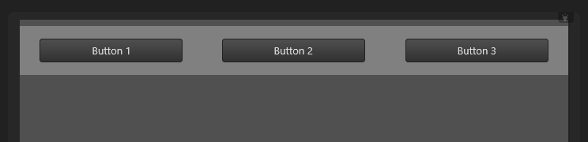
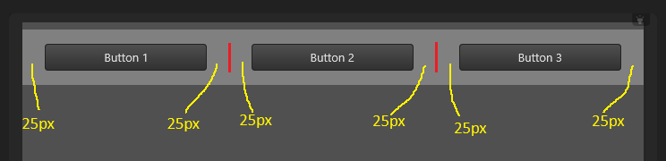

# Gutters in the Grid System

Gutters are horizontal gaps inserted between `col` and/or `block` controls, as well as at the start and end of a row's content. They are used to create space and improve the visual layout of the interface.

Gutters are measured in pixel count, with the default size set to 30 pixels.

## Defining Gutter Size

- **[`g-cnt-gutter`](attrs/g-cnt-gutter.md)**: This attribute allows you to set the gutter size for all content controls within a control. By defining this attribute, you can ensure consistent spacing throughout the content.

- **`g-gutter`**: Alternatively, you can use the `g-gutter` attribute to define the gutter size for a single control. This attribute takes precedence over the [`g-cnt-gutter`](attrs/g-cnt-gutter.md) attribute, allowing you to customize the spacing for individual controls.


## Precedence and Inheritance

- If the `g-gutter` attribute is not defined for a control, the gutter size used is the value defined by the parent [`g-cnt-gutter`](attrs/g-cnt-gutter.md) attribute.
- If the parent control does not define a [`g-cnt-gutter`](attrs/g-cnt-gutter.md), the grid system will recursively search for the first ancestor control that defines a value for [`g-cnt-gutter`](attrs/g-cnt-gutter.md) and use that value.
- If no ancestor control defines a [`g-cnt-gutter`](attrs/g-cnt-gutter.md) attribute, the default gutter size of 30px will be used.


## Example

Defining the gutter size to 50px:

```xml
<form>
	<rectangle g="container" g-cnt-gutter="50">
		<button text="Button 1" g="col" g-width="4"/>
		<button text="Button 2" g="col" g-width="4"/>
		<button text="Button 3" g="col" g-width="4"/>
	</rectangle>

	
	<style>
		form { g-padding-top: 8; g-cnt-line-spacing: 4; theme: dark; }	
		rectangle { color: gray; g-padding-top: 16; g-padding-bottom: 16; }				
		button { height: 30; } 
	</style>	
</form>	
```

The resulting layout:



The gutters in the layout:



!!! note
	Half of the gutter size is applied before the control, and the other half is applied after the control.